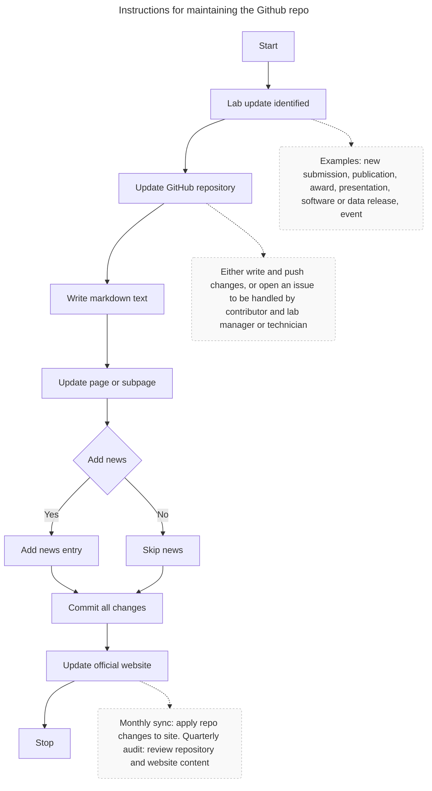

# Description
The goal of this repository is to store the content and records of the website(s) associated with the Luque lab and hosted elsewhere. The content is preferentiably stored in text file formats and other reusable formats. This sets best practices in data management for the lab's content and would facilitate migrating website content to other servers or services when needed. This respoitory is the primary source of information for any related website for the lab, so it needs to be updated first before updates are reflected on the websited hosted in other servers. Here is the current list of maintained websites:
+ Temporary website: <https://luquelab.github.io/test_webpage/>

# Content
Files and folders:
+ `README.md`: This file includes instructions (see below) on how to maintain and update the repository and reflect changes in associated websites.
+ `/docs`: This folder contains the markdown files with the content for the webistes organized by pages and including page dependencies and instructions for updateing and formatting each page.
+ `/resumes`: This folder contains the Academic CV and functional resume files for current and prior lab members.

# Instructions
The repository is maintained and updated following the protocol illustrated in the flowchart below and described in text format after the figure.

1. **Lab New Item** \
   This is the trigger. Here are examples:
    + New submission (paper/grant)
    + Publication 
    + Awards 
    + Presentations 
    + Software/ data release 
    + Events 
  
2. **Update Github website repository**: 
     + Generate markdown text.
     + Update specific page/subpage. 
     + Add news if appropriate.
     + Contributors must either write the text and upload the changes in the repo or generate an issue in the repository that need to be addressed by the contributor and the lab manager/technician within a lab data management cycle.
     + Once the item is updated, generate an issue in the repository to indicate that an item has been modified and is ready to be updated to the official website.
   
3. **Update Official Website**: 
    + Update any changes uploaded in the repository to the associated lab website(s) once a month: The first day of the month (or first working day possible).
    + Review the repository content and lab website(s) content once a quarter, during the days associated to lab data management and overview.

